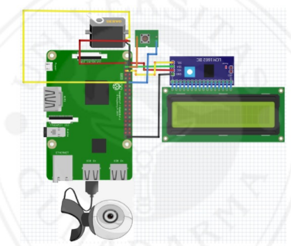

# Locker Safe Security System using Webcam Face Recognition

## Description

This project implements a locker safe security system using face recognition with a webcam. The system captures images of users, stores them, trains a face recognition model, and then allows access based on recognized faces. The system controls a servo motor for locking and unlocking the locker and displays status information on an I2C LCD screen.

## Schematic:


## Features

- Face detection and recognition using OpenCV and Haar Cascades.
- User data stored in an SQLite database.
- Servo motor control for locking and unlocking.
- LCD display showing lock status and recognized users.
- Button to manually lock the system.

## Circuit Schema:

- 

## Prerequisites

- Python 3.x
- OpenCV
- NumPy
- PIL (Pillow)
- SQLite3
- RPi.GPIO (for Raspberry Pi GPIO control)
- I2C_LCD_driver (for I2C LCD screen)

## Installation

1. Clone the repository and navigate to the project directory.

   ```bash
   git clone https://github.com/veendysuseno/Face-Recognition-for-Safe-Access
   cd your-project-directory
   ```

2. Install required Python packages:

   ```bash
   pip install opencv-python opencv-contrib-python numpy Pillow RPi.GPIO
   ```

3. Set up the hardware:

   - Connect the servo motor to GPIO pin 17.
   - Connect the button to GPIO pin 18.
   - Connect the I2C LCD screen and ensure the I2C drivers are installed.

4. Create the necessary directories for saving data:
   ```bash
   mkdir dataset recognizer
   ```

## Usage

### Step 1: Capture User Dataset

Run the `Dataset.py` script to capture images of a new user and store them in the dataset folder.

```bash
python Dataset.py
```

### Step 2: Train the Model

After capturing images, run the Datatrain.py script to train the face recognizer model.

```bash
 python Datatrain.py
```

### Step 3: Run the System

Finally, run the main.py script to start the recognition and control the lock mechanism.

```bash
python main.py
```

## Troubleshooting

- If the system does not detect faces, ensure that the haarcascade_frontalface_default.xml file is in the Classifier/ directory.
- Ensure all hardware (servo motor, LCD, button) is properly connected to the Raspberry Pi.
- If the camera is not accessible, check that it's properly connected and enabled.
